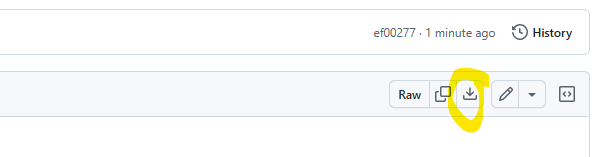

# Step 1 Power Query

> **_DOWNLOAD:_**  [Go to vgsales.csv on GitHub](https://github.com/uviclibraries/PowerBI/blob/main/Data/vgsales.csv) click the download button in the top right-hand corner

[NEXT STEP: Dax ](2-DAX.md){: .btn .btn-blue }
